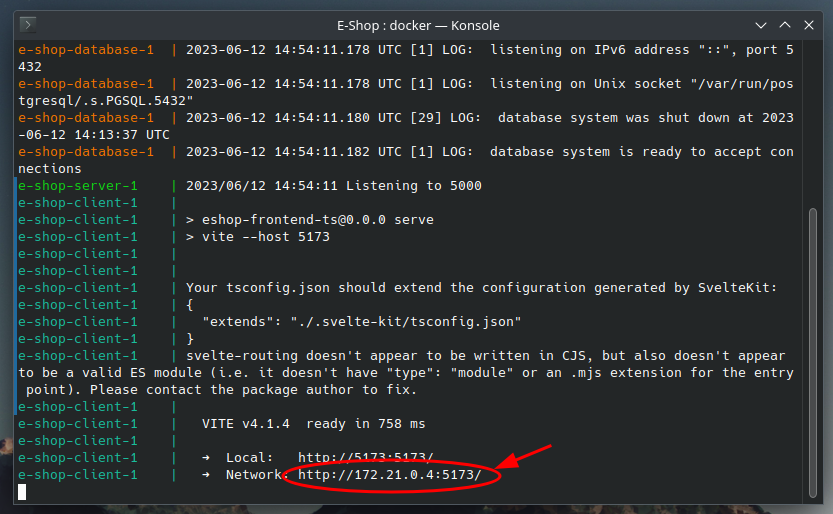

# About this project
World of tea e-shop is a CRUD app created from scratch without the use of external e-commerce APIs. 
## **Technologies used are :**
* Golang for back-end
* PostgreSQL
* Svelte and Sveltekit for front-end
* Docker and Docker-Compose for containerization of the app

The back-end is written without the use of any API libraries, and uses standard Go libraries to create and send the HTTP requests to the front end while having CORS. It also uses GORM to communicate with the database. 
Lastly, user authentication is implemented using JSON web tokens and passwords are hashed using SHA-256 hashing algorithm. 
 The front-end is written in Svelte and uses Vite as its development server. It also uses the Axios HTTP client for receiving the HTTP requests from the API.
# Live demo (release)
The latest version of the app is currently hosted on:  
http://83.212.80.84:4173/
## IMPORTANT NOTES:
* View the application **using a modern web browser on PC**. The application is not yet optimized for mobile devices.
* Do not **panic** if you enter any **real passwords** on it; The application uses JWT authentication and all passwords are hashed using SHA-256, so no password is visible in plain text form.
# Dockerization details
The app has been fully containerized with the use of Docker and docker-compose. 
The docker compose YAML file consists of three containers that have the services for the application, below they are listed ordered by dependancy :  
* **Database container** : This container contains the PostgreSQL database server, it uses the Postgres 15.3 docker image and has persistent storage at /var/lib/postgresql/data. The YAML file also contains configuration for the database with a pre-set password and username and port you can change.
* **Server container** : The server is located in this container, it has a dependency on the database container and uses the golang alpine image. The YAML file also has configuration for the server, which is the username and password for the database, the secret encryption key for the user data and the server port. The go alpine image is used in this container.
* **Client container** : This is the container for the client app, it depends on the server container. It has configuration for the port where the client application is served, the YAML docker compose file in this repo uses the port 5173, although you can change that if you so wish. Node 19 alpine image is used for this container.
  
Also, all the containers run in their own virtual network.
# Set up and run with Docker (Recommended)
For your linux distribution of choice, install docker. 
You can find resources about installing docker from:  
https://docs.docker.com/engine/install/  
Then, install docker compose. You can find resources for installing it at:  
https://docs.docker.com/compose/install/  
Then in the project root directory run the command :  
``
docker compose up
`` 
  Now the e-shop should be fully functional and accessible in its own virtual network.  
**You can find the address needed to access the app from your web browser, by looking at the standard output of the client container like demonstrated below :**

## IMPORTANT NOTE
In case the database is not working (you get a blank products page), stop all containers with the command :
 ``
docker compose down
`` 
And then re-start the containers again with the command :  
``
docker compose up
``  
After you start them, the app should function without any issues.
# Set up and run without Docker (Not recommended)
The following instructions will help you set up and run this application on your own machine, without docker. 
The instructions are for arch-based and debian-based linux distributions.
## Step 1. Installing required packages
### 1) Go
For arch-based distros :  
``
sudo pacman -S go
``  
For debian-based distros :  
``
sudo apt install snapd
``
 
``
sudo snap install go --classic
``  
<strong>Note </strong> : Its recommended you install Go using snap on debian-distros, since this application requires atleast <strong>Go version 1.18</strong> to work, and most debian repos have outdated Go versions as of writing these instructions (Usually version 1.15 is available in most debian repositories). In contrast, snap will easily install the latest version of Go.
### 2) PostgreSQL
For arch-based distros :  
``
sudo pacman -S postgresql
``
 
For debian-based distros :  
``
sudo apt install postgresql
``
  
After you install the postgresql package, you must enable and start the postgreSQL service on your system, and also set up an admin password for the database server.
  
To run and enable the postgreSQL services on both arch-based and debian-based distros :
 ``
sudo systemctl enable postgresql
`` 
``
sudo systemctl start postgresql
`` 
 
After you set up the services, login to the postgre user and change the password to anything you like.
  To login to the postgre user:  
``
sudo -u postgres psql
`` 
To change the password of postgres user (after logging in) :
 
``
\password postgres
``

### 3) Node js and npm
For arch-based distros:  
``
sudo pacman -S nodejs
`` 
``
sudo pacman -S npm
`` 
For debian-based distros:  
``
sudo apt install -y curl
`` 
``
curl -sL https://deb.nodesource.com/setup_19.x | sudo -E bash -
`` 
``
sudo apt install -y nodejs
`` 
## Step 2. Configuring database
The back-end server automatically seeds the database with some base data if it is blank. This means that you only have to create a blank database with no tables called "eshop".  
To do so in postgreSQL , you must first log in to the postgres user : 
``
sudo -u postgres psql
`` 
Then, you must create a database for the application, name it whatever you like, for this example we will use "eshop" :  
``
CREATE DATABASE eshop;
`` 
 
After you create the database and the user, you must substitute the database name, database username, and database password, aswell as the secret key for the encryption of credentials in the file "SetupDBvars.sh" found in "/Eshop/server", so the server can access these variables.
## Step 3. Running server & client
### Running the server
Before running the server, set up the database vars from the previous step using the script "SetupDBvars.sh" :  
``
source SetupDBvars.sh
`` 
To run the server, go to the E-Shop/server/ directory and type: 
For arch-based distros :  
``
go run .
`` 
For debian-based distros :  
``
snap run go run .
``
### Running the client
To run the client, go to the E-Shop/client/ directory and type: 
``
npm install
`` 
``
npm run build
`` 
``
npm run preview
``
  
You now should have the app fully functioning, and ready to use by navigating to 
http://localhost:4173 on any modern web browser.
